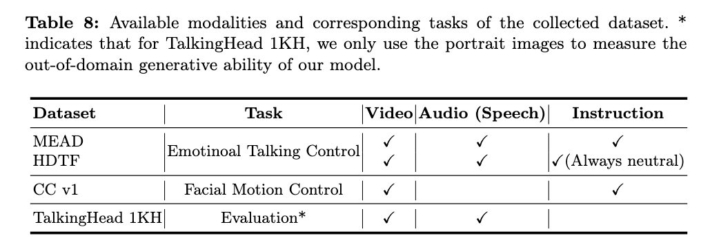

<h1 align="center">
 InstructAvatar: Text-Guided Emotion and Motion Control for Avatar Generation
</h1>
<h4 align="center">
  <a href="https://wangyuchi369.github.io/">Yuchi Wang</a> &nbsp; 
  <a href="https://renshuhuai-andy.github.io/">Junliang Guo</a> &nbsp;
  <a href="https://jianhongbai.github.io/">Jianhong Bai</a> &nbsp;
  <a href="https://ingrid789.github.io/IngridYu/">Runyi Yu</a> &nbsp;
  <a href="https://www.microsoft.com/en-us/research/people/xxxx/">Tianyu He</a>
  </h4>
  <h4 align="center">
  <a href="https://tan-xu.github.io/">Xu Tan</a> &nbsp;
  <a href="https://xusun26.github.io/">Xu Sun</a> &nbsp;
  <a href="https://sites.google.com/view/jiangbian">Jiang Bian</a>
</h4>

<br>

<div align=center>

<h4 align="center">
  <a href="https://arxiv.org/abs/2405.15758">[ArXiv]</a> &nbsp; &nbsp;&nbsp;&nbsp;&nbsp;&nbsp;&nbsp;&nbsp;
  <a href="https://wangyuchi369.github.io/InstructAvatar/">[Demo Page]</a> &nbsp;
</h4>  
</div>


## ⚠️ Attention

Thank you for your interest in our work **"InstructAvatar: Text-Guided Emotion and Motion Control for Avatar Generation."** 

We are actively working on open-sourcing this project. However, due to certain constraints, such as the closed-source nature of the [GAIA model](https://www.microsoft.com/en-us/research/publication/gaia-zero-shot-talking-avatar-generation/) and the ethical guidelines of our institution, we can only provide ‼️ **a portion of the code**‼️. Below, we outline what will be included and what will not be shared.


### ❌ What We Cannot Provide

- **Pretrained Checkpoints and Model Weights:**  Our method builds upon the [GAIA model](https://www.microsoft.com/en-us/research/publication/gaia-zero-shot-talking-avatar-generation/), which is not open-source and has no current plans for public release. As a result, we cannot provide the pretrained model weights. We understand this limitation may affect reproducibility, and we will update this repository if there are any changes to GAIA's availability.

- **Landmark Extraction Tool:** GAIA utilizes an [internal Microsoft tool](https://microsoft.github.io/FaceSynthetics/) for facial landmark extraction. Since this tool is proprietary and closed-source, we are unable to release it to the community.

- **OpenAI API Key:** Of course😂.


### ✅ What We Can Provide

- **Preprocessing Code for Training Datasets:**  We provide utility functions to preprocess datasets for text-guided emotional talking tasks. These functions can be adapted to your own datasets for similar research purposes.

- **Prompt Templates for GPT-4V:**  We offer ready-to-use prompt templates for GPT-4V to generate rich, diverse, and fluent instructions. You can use these templates along with your own OpenAI API key to create high-quality training data.

- **Model Structure and Training Code:**  We share the full structure and training code for the InstructAvatar model, allowing users to understand and customize the training process for their own research.

- **Inference Code:**  Our inference code enables simultaneous control of **emotional talking** and **facial motion** in avatar generation. 


We understand that the absence of GAIA's code, datasets, and pretrained weights may limit the immediate usability of our model. Therefore, ‼️ we aim to position this repository as a **training recipe for text-guided avatar generation**‼️. Our goal is to provide essential preprocessing scripts, model training code, and step-by-step guidance so users can train their own models from scratch.  ✨

We sincerely apologize for any inconvenience this may cause. If you have any questions, please feel free to reach out to us. Thank you for your understanding and support! 🤗  


## 💡 Introduction

Recent advancements in talking avatar generation have achieved significant progress in realistic and accurate lip synchronization with audio. However, these methods often struggle to capture and convey fine-grained emotional expressions and facial motion, resulting in less vivid and less controllable avatars.  

In this work, we propose **InstructAvatar**, a novel text-guided framework for generating emotionally expressive 2D avatars. Our approach enables fine-grained control, enhanced interactivity, and greater generalizability for avatars. By utilizing natural language instructions, users can control both the talking emotion and facial motion of avatars with greater precision and expressiveness.  


## ⚙️ Environment

To run the code, please ensure you have the required packages and dependencies listed in the `requirements.txt` file. You can set up the environment using Conda with the following commands:

```bash
# Create and activate a new Conda environment
conda create -n instructavatar python=3.10
conda activate instructavatar

# Install PyTorch and dependencies
pip3 install torch torchvision torchaudio --index-url https://download.pytorch.org/whl/cu117

# Install additional required packages
pip install -r requirements.txt
```

## 🚢 Datasets and Preprocessing

We use the following datasets for training and testing:  
- **Training Datasets**: MEAD, CC v1, and HDTF  
- **Testing Dataset**: Talking Head 1KH  

Below, we outline the preprocessing steps required for each dataset.  


### 📦 Extracted Information

During preprocessing, we extract the following information from each dataset:  

```python
return {
    "motion_latent": motion_latent,
    "ldmk": ldmk,
    "appear_latent": appear_latent,
    "audio_feat": audio_feat,
    "latent_length": aligned_latent_len,
    "filename": self.data[i]['filename'],
    "pose": pose,
    "instruction": instruction,
    "inst_flag": inst_flag,
    "audio_flag": audio_flag
}
```
These extracted features are crucial for training. Each dataset represents a different data type, so the preprocessing steps may vary. Below is an overview of the preprocessing approach for each dataset.



### 📘 MEAD Dataset

The MEAD dataset consists of talking videos with **emotion labels**, making it a key resource for training models to understand and generate emotional expressions. Below are the steps for extracting the required features.  


#### Audio Feature
1. Convert to WAV: Use the following script to convert the original audio files to WAV format:  
   `preprocess/MEAD_utils/convert_to_wav.py`

2. Extract Audio Features: Extract audio features using the **Wave2Vec** model:  
   `preprocess/TETF/process_audio.py`

   > **Note**: The checkpoint for the Wave2Vec model can be downloaded from [this link](https://github.com/facebookresearch/fairseq/blob/main/examples/wav2vec/README.md).  


#### Pose Latent
The pose latent encodes the head orientation of the avatar. To extract the pose latent, use the following script: `preprocess/MEAD_utils/infer_headpose.py`. 

#### Appearance and Motion Latents
We use the **[GAIA model](https://www.microsoft.com/en-us/research/publication/gaia-zero-shot-talking-avatar-generation/)** to extract the **motion latent** and **appearance latent**. The procedure is as follows:  

1. Landmark Extraction: Extract the facial landmarks using the GAIA model's internal tool.  
2. Latent Extraction: Use the GAIA model to extract the appearance and motion latents.  

Run the following script to extract latents: `preprocess/infer_latent/infer_MEAD.sh`

> **⚠️ Important Note**:  
> The GAIA model and its landmark extraction tool are closed-source, so **this step cannot be executed directly**. We provide suggestions later in this repository for training your own minimal GAIA-like model.  


#### Instructions
The process to obtain the textual instructions is as follows:  

1. **Extract Action Units (AU)**: Use this script to extract AU features:  
   `preprocess/MEAD_utils/detect_au/face_torch_mead.py`

2. **Generate Instructions via GPT**: Use GPT to convert AU features into natural language instructions:  
   `preprocess/MEAD_utils/gpt-para/paraphrase_au_gpt4_v.py`

> **Note**: You will need an **OpenAI API key** to use the GPT-based script.  


### 📙 CC v1 Dataset

The CC v1 dataset is used to train the **facial motion control** task. Since it does not contain audio, we follow a slightly different approach for preprocessing.  


#### Appearance and Motion Latents
The process for extracting **appearance and motion latents** is the same as for the MEAD dataset.  

#### Audio Feature (Pseudo-Audio)  
Since the CC v1 dataset does **not contain audio**, we create a pseudo-audio file with zero amplitude to maintain compatibility with models expecting audio input.  

Run the following script to generate pseudo-audio: `preprocess/empty_audio/generate_empty_video.py`

This script creates a silent audio file with the same duration as the ground truth video.  


#### Instructions
The CC v1 dataset includes textual instructions stored in `preprocess/text2motion/video2instruction.json`. We further diversify and enhance the instructions using GPT prompts in `preprocess/text2motion/gpt4_para.py`.


#### Pose Latent
Pose latents are **not required** for the CC v1 dataset, as facial motion control does not rely on head pose.  


### 📗 HDTF Dataset

The HDTF dataset is used to ensure that the model retains basic lip-sync capabilities. The preprocessing procedure is similar to that of the MEAD dataset, with the key difference being that each video clip in the HDTF dataset is paired with a **neutral instruction**.


### 📕 Talking Head 1KH Dataset

The Talking Head 1KH dataset is used for out-of-distribution (OOD) appearance testing. For this purpose, we pre-extract frames and landmarks from the video. No additional preprocessing steps are required. 


### ❄️ Build LMDB

We use LMDB (Lightning Memory-Mapped Database) to store the dataset. LMDB is a high-performance, transactional key-value store that enables efficient data storage and fast access. 

To facilitate this process, we provide a script for building LMDB files in the directory: `preprocess/TETF/create_lmdb`. You can use this script to build LMDB for any dataset with minimal adjustments. 


## 🚀 Basics for Training

We use the [PyTorch Lightning](https://lightning.ai/docs/pytorch/stable/) framework for training, following the design philosophy of the Stable Diffusion series. Our guiding principle is:  
> **Modularity is king**  

To achieve this, we adopt a **config-driven approach** where submodules are built and combined using `instantiate_from_config()`, similar to the method used in Stable Diffusion. 

The main configuration file can be found at `configs/a2vqvae-hdtf-ccd-avena-pose-ep12/unified/split/unified_with_pose_small_unify_split_varlen_eos_intensity_para_varkey_all_data.yaml`. This file defines key components, including **model**, **data**, and **lightning** configurations, each of which is described below.  

### 🧩 Model Part

The core module used for model design is `talking.models.a2vqvae.diff_keyla_headpose.UnifiedSplitEOSTETFAllTalkingA2VqvaeKeylaPoseModel`. It encapsulates the logic for receiving input from the DataLoader, handling the training and sampling process, and calculating the loss. To maintain a modular design, specific submodules, such as the text encoder and audio encoder, are defined separately in the `talking.modules` folder.  


### ✉️ Data Part

we use `talking.data.a2vqvae_hdtf_ccd_avena.keyla_lmdbdir_pose.VarLenTETFUnifyRandomKeylaTalkingA2VqvaeSeqKeylaSepeLMDBTrain` as the data class.

Key responsibilities of this data class include:  
- **LMDB Loading**: It loads the LMDB database, providing efficient data access.  
- **Sequence Sampling**: Samples sequences from the LMDB to be used as training sequences.  
- **Data Alignment**: Ensures that all information (e.g., video, audio, text) within a sequence is aligned to the same length, which is essential for consistent training.  


### ⚡ Lightning Part

It mainly defines several hyperparameters to control and record the training state, such as `max_epochs`, `gpus`, `logdir`, `resume_from_checkpoint`, and others.


### 🏃 Runing Method


As described in `scripts/run_exp.sh`, you can run the experiments by calling `main.py`.

Here is an example:
```bash
#!/bin/bash

python main.py --base configs/xxxxx.yaml --train --trainer.devices 8 --logdir /xxxx/xxx/ --extra 'model.base_learning_rate=5.e-6,model.params.backbone_config.params.dropout=0.08'
```
- base: Specifies the config file to use.
- --train: Indicates that the model is in training mode.
- --trainer.devices: Specifies the number of GPUs to use (in this case, 8 GPUs).
- --logdir: Specifies the directory to save the training logs.
- --extra: Allows you to override hyperparameters in the config file (e.g., changing the learning rate and dropout rate).

## 🎯 Basics for Testing

The testing method is defined in `talking/scripts/evaluate_e2e_tetf_pose_all_unified.sh`.

Here is a description of the script parameters:

```bash
APPEAR_DIR  # Directory containing appearance images (jpg/png)
INSTRUCTION  # Instruction for the testing
AUDIO_DIR  # Directory containing the audio for testing (should be in wav format)
A2E_CONFIG  # Config file for the model
INST_FLAG  # Indicates whether an instruction is provided
AUDIO_FLAG  # Indicates whether audio is provided
CKPT  # Model checkpoint to evaluate
```
By modifying the values of INST_FLAG and AUDIO_FLAG, you can test the model for different tasks, such as emotional talking or facial motion control.

For benchmark evaluation and related metrics, the following scripts may be helpful: `talking/scripts/eval_benchmark_score_unify.sh`, `talking/scripts/lip_sync_score.py`, `talking/scripts/calculate_au_score.py`.

## 😊 Your Own Minimal VAE GAIA

As mentioned in the previous section, we use the GAIA model to extract the appearance and motion latents as training targets. However, since the GAIA model does not release its checkpoint, we provide some basic ideas for training your own VAE model. The basic config file can be found in `configs/vqvae_2enc-hdtf/tetf_autoencoder_scale_avena_extend_dense_64x64x3.yaml`.

The main idea is to use the i-th landmark (representing motion) and the j-th image to reconstruct the i-th RGB image.


### 🏠 Data

The code is implemented in `talking.data.vqvae_2enc_hdtf.diffae_data.ExtendedAvenaDataset`. Based on the basic idea, we randomly select two images from a video. For the j-th video, we will extract the landmarks.

**Note**: In GAIA, they use the internal landmark extraction tool, specifically the `RegressLandmarksFromImages` class (line 1118 in `talking/data/vqvae_2enc_hdtf/diffae_data.py`). However, this tool is closed-source. You may consider using the open-source package **dlib** to predict landmarks (as shown below). We also provide a basic function to achieve this. However, note that this model only detects 68 key points, while the GAIA tool uses 669 landmarks. More key points provide a better representation of motion information, so you may want to explore other facial alignment tools or commercial alternatives.

``` python
        def get_ldmk(frame):
            img = Image.fromarray(frame).convert('RGB').resize((256,256))
            img_array = np.asarray(img)
            faces = detector(img_array)
            if len(faces) != 1:
                return None
            # 68 sparse ldmks
            sparse_ldmks = predictor(img_array, faces[0])
            sparse_coords = np.zeros((sparse_ldmks.num_parts, 2), dtype=np.uint8)
            for i in range(sparse_ldmks.num_parts):
                sparse_coords[i] = (sparse_ldmks.part(i).x, sparse_ldmks.part(i).y) 
                    
            size=(256,256)
            canvas = np.zeros((size[0], size[1], 3), dtype=np.uint8)
            for i in range(sparse_coords.shape[0]):
                x = int((sparse_coords[i][0]))
                y = int((sparse_coords[i][1]))

                canvas = cv2.circle(canvas, (x, y), 1, (255,255,255), -1)

            return canvas
```


### 🧚 Model

The code is implemented in `talking.models.vqvae_2enc.autoencoder.AutoEncoderKLwithLDMK`. The model consists of two encoders and a decoder. We use the appearance encoder to encode the j-th image and the motion encoder to encode the i-th landmark image. The two latents are then concatenated and passed into the decoder, aiming to reconstruct the i-th RGB image.

Initially, the appearance encoder is initialized from Stable Diffusion, and the motion encoder shares the same initialized parameters.

Since the motion latent contains less information, we apply a higher downsampling rate to it.


## 🍃 Acknowledgements
Our code is heavily based on projects like [stable diffusion](https://github.com/CompVis/stable-diffusion), [facetorch](https://github.com/tomas-gajarsky/facetorch), [GAIA](https://www.microsoft.com/en-us/research/publication/gaia-zero-shot-talking-avatar-generation/). Thanks for their splendid works!


## ☕ Citation
 If you find our projects helpful to your research, please consider citing our paper:
```
@misc{wang2024instructavatar,
      title={InstructAvatar: Text-Guided Emotion and Motion Control for Avatar Generation}, 
      author={Yuchi Wang and Junliang Guo and Jianhong Bai and Runyi Yu and Tianyu He and Xu Tan and Xu Sun and Jiang Bian},
      year={2024},
      eprint={2405.15758},
      archivePrefix={arXiv},
      primaryClass={cs.CV}
}
```

