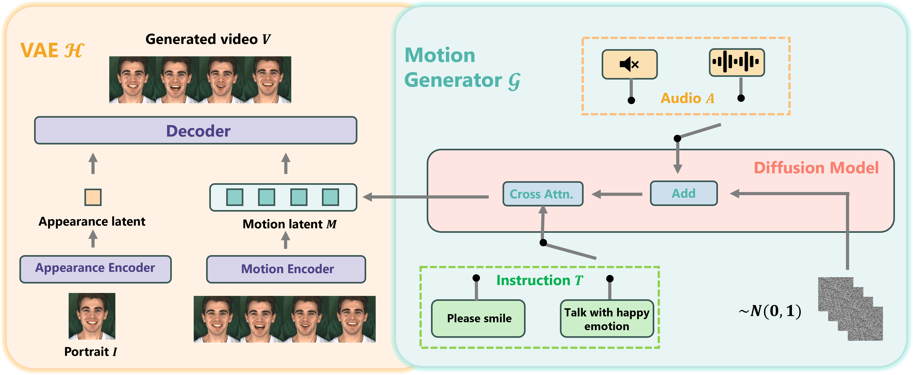

<h1 align="center">
 InstructAvatar: Text-Guided Emotion and Motion Control for Avatar Generation
</h1>
<!-- <h4 align="center">
  <a href="https://wangyuchi369.github.io/">Yuchi Wang</a> &nbsp; 
  <a href="https://renshuhuai-andy.github.io/">Junliang Guo</a> &nbsp;
  Rundong Gao &nbsp;
  <a href="https://yaolinli.github.io/">Linli Yao</a> &nbsp;
  <a href="https://beeevita.github.io/">Qingyan Guo</a>
  </h4>
  <h4 align="center">
  Kaikai An &nbsp;
  <a href="https://jianhongbai.github.io/">Jianhong Bai</a> &nbsp;
  <a href="https://xusun26.github.io/">Xu Sun <sup>&dagger;</sup></a>
</h4> -->

<h4 align="center">
  <a href="https://wangyuchi369.github.io/InstructAvatar/">[ArXiv]</a> &nbsp; &nbsp;&nbsp;&nbsp;&nbsp;&nbsp;&nbsp;&nbsp;
  <a href="https://wangyuchi369.github.io/InstructAvatar/">[Demo Page]</a> &nbsp;
</h4>  
<div align=center>

</div>

<!-- <br> -->
## ‼️ Attention
This repository **currently contains only the implementation of the demo website** for the paper "InstructAvatar: Text-Guided Emotion and Motion Control for Avatar Generation." ⚠️

Since InstructAvatar can generate and control photorealistic talking videos, it poses significant ethical risks of unintended misuse. We are currently undergoing the release process and internal compliance reviews. Please stay tuned!

In the meantime, feel free to raise any issues in this repo if you have any questions! 🤗


<!-- <div align=center>

</div> -->

<!-- ## 💡 Introduction


Diffusion models have demonstrated remarkable capabilities in text-to-image generation. However, their performance in image-to-text generation has lagged behind Auto-Regressive (AR) models, raising doubts about their applicability for such tasks. In this study, we revisit diffusion models, emphasizing their unique advantages compared to AR methods. We meticulously design a novel latent diffusion-based architecture, LaDiC, to further amplify the previously untapped potential of diffusion models in image-to-text generation.

## 🚀 Method

<div align=center>

</div>

An overview of our LaDiC model. It mainly consists of the Image Encoder, Text Encoder, Diffuser, and Text Decoder. The diffusion process is depicted on the left, while the denoising process is depicted on the right. Initially, the caption $c$ is encoded into a text latent $x_0$ by the text encoder. Subsequently, diffusion process occurs within the textual latent space $\mathcal{X}$, where a diffuser is trained to restore the noisy text latent $x_t$ to its clean counterparts $\hat{x}_0$, guided by the associated image. Finally, the denoised text latent $\hat{x}_0$ is passed through a NAR text decoder to generate the final caption $\hat{c}$.

## 📖 Experimental Results

<div align=center>

</div>

Comparison results on COCO dataset. We can see that our model **achieves state-of-the-art performance across various metrics for both diffusion-based and traditional NAR models, and exhibits comparable performance with some well-established pretraining auto-regressive frameworks**, despite being trained on significantly less data.

<div align=center>

</div>

Apart from achieving exceptional performance, compare to AR methods, we also observe the superiority of our model in:

- **Parallel Token Emission**: Diffusion-based model emits all tokens in parallel, effectively reducing the inference latency compared to autoregressive models, particularly as the length of the caption increases.

- **Holistic Context Consideration**: Diffusion model takes into account a more comprehensive context, thereby helping to alleviate the error accumulation issues inherent in autoregressive models.

- **Flexible Generation Approach**: In contrast to the unidirectional generation approach of AR models, the diffusion model adopts a more flexible manner of generation.
## ⚙️ Environment

Required packages and dependencies are listed in the `ladic.yaml` file. You can install the environment using Conda with the following command:

```bash
conda env create -f ladic.yaml
conda activate ladic
```

We also provide docker image as follows:

```bash
docker pull wangyuchi/diffcap:python3.8
```
### Accelerate Configuration

We use [accelerate package](https://huggingface.co/docs/accelerate/index) developed by Huggingface.

Configure Accelerate by using the following command in the command line:

```bash
accelerate config
```

Answer the questions based on your actual setup. You will be prompted to specify the GPU to use, and other configurations can be left as default. For more information, refer to [this link](https://huggingface.co/docs/accelerate/v0.13.2/en/quicktour#launching-your-distributed-script).

## 🚢 Datasets

We test on the COCO dataset. You can download [MSCOCO dataset](https://cocodataset.org/#download) and place it into `datasets` folder.

Meanwhile, we follow Karpathy split, and its annotation files can be found in its [orginial paper](https://cs.stanford.edu/people/karpathy/deepimagesent/). Our code will also automatically download these files and you may find them in `datasets/` folder.

## 🧰 Required pretrained models

In our LaDiC model, Text Encoder and Decoder are initialized from BERT-base-uncased, which can be downloaded from [Huggingface](https://huggingface.co/bert-base-uncased).

As for image encoder, we utilized pretrained ViT in BLIP. You may download from [here](https://storage.googleapis.com/sfr-vision-language-research/BLIP/models/model_base_capfilt_large.pth) and put it into `pretrained_ckpt` folder. More information can be found in [BLIP&#39;s official repo](https://github.com/salesforce/BLIP).


## 🎇 Training

Launch the `main.py` script using Accelerate with the following command:

```bash
accelerate launch main.py [--args]
```

We list some important optional parameters as follows. The `notes` parameter is both a note to be placed at the top of the filename and the running name for [wandb](https://wandb.ai/site). More hyperparameters and their description can be found in `configs/`

```bash
parser.add_argument('--notes', type=str, default=None, help='Note to be included in the trial name')
parser.add_argument('--bsz', type=int, default=5, help='batch size')
parser.add_argument('--seqlen', type=int, default=80, help='sequence length')
parser.add_argument('--epoch', type=int, default=10, help='epoch num')
parser.add_argument('--resume_epoch', type=int, default=0, help='start epoch of resume')
parser.add_argument('--resume_ckpt', type=str, default=None, help='resume or not')
parser.add_argument('--logdir', type=str, default='checkpoint', help='logdir')
```

## ⚖️ Evaluation

Specify `MODEL_NAME` and `RESULLT_FILE` in `coco_eval.py` representing checkpoint to be evaluated and output path respectively. Then you can run

```bash
python coco_eval.py
```

## 📆 TODO List
- [ ] Add more scripts for more flexible testing.
- [ ] Provide pretrained checkpoint.
- [x] Provide training and testing code.
- [x] Paper released on arXiv.

## ☕ Citation
 If you find our projects helpful to your research, please consider citing our paper:
```
@misc{wang2024ladic,
      title={LaDiC: Are Diffusion Models Really Inferior to Autoregressive Counterparts for Image-to-Text Generation?}, 
      author={Yuchi Wang and Shuhuai Ren and Rundong Gao and Linli Yao and Qingyan Guo and Kaikai An and Jianhong Bai and Xu Sun},
      year={2024},
      eprint={2404.10763},
      archivePrefix={arXiv},
      primaryClass={cs.AI}
}
```
For any issues or further discussions, feel free to contact wangyuchi369@gmail.com
## 🍃 Acknowledgements
Our code is heavily based on projects like [diffusion-image-captioning](https://github.com/xu-shitong/diffusion-image-captioning), [BLIP](https://github.com/salesforce/BLIP) and [Huggingface transformers](https://github.com/huggingface/transformers). Thanks for their splendid works! -->
